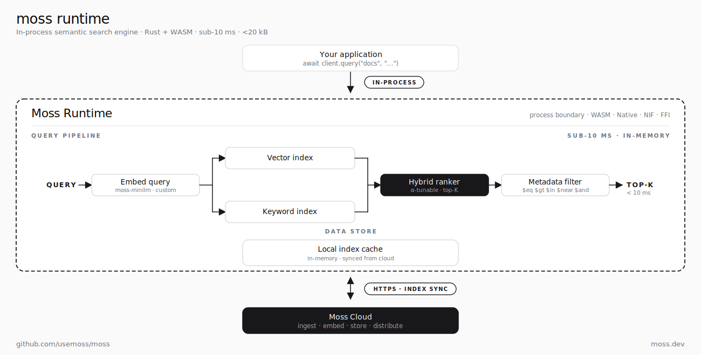

<!-- markdownlint-disable MD033 MD041 -->

<div align="center">


# Moss

### Real-time semantic search for AI agents. Sub-10 ms.

[](https://opensource.org/licenses/BSD-2-Clause)
[](https://pypi.org/project/moss/)
[](https://pepy.tech/project/moss)
[](https://www.npmjs.com/package/@moss-dev/moss)
[](https://www.npmjs.com/package/@moss-dev/moss)
[](https://moss.link/discord)

[Website](https://moss.dev) · [Docs](https://docs.moss.dev) · [Discord](https://moss.link/discord) · [Blog](https://moss.dev/blog)

</div>

---

Moss is the search runtime that lives inside your conversational AI agent.

Index documents, query them semantically, and get results back **in under 10 ms** - fast enough for real-time conversation.

If you find Moss useful, [star the repo](https://github.com/usemoss/moss) ⭐


## Quickstart

**Before you start:** sign up at [moss.dev](https://moss.dev) for a free `project_id` and `project_key`. The snippets below need Python 3.10+ or Node.js 20+.

### Python

```bash
pip install moss
```

```python
from moss import MossClient, QueryOptions

client = MossClient("your_project_id", "your_project_key")

# Create an index and add documents
await client.create_index("support-docs", [
    {"id": "1", "text": "Refunds are processed within 3-5 business days."},
    {"id": "2", "text": "You can track your order on the dashboard."},
    {"id": "3", "text": "We offer 24/7 live chat support."},
])

# Load and query — results in <10 ms
await client.load_index("support-docs")
results = await client.query("support-docs", "how long do refunds take?", QueryOptions(top_k=3))

for doc in results.docs:
    print(f"[{doc.score:.3f}] {doc.text}")  # Returned in {results.time_taken_ms}ms
```

### TypeScript

```bash
npm install @moss-dev/moss
```

```typescript
import { MossClient } from "@moss-dev/moss";

const client = new MossClient("your_project_id", "your_project_key");

// Create an index and add documents
await client.createIndex("support-docs", [
  { id: "1", text: "Refunds are processed within 3-5 business days." },
  { id: "2", text: "You can track your order on the dashboard." },
  { id: "3", text: "We offer 24/7 live chat support." },
]);

// Load and query — results in <10 ms
await client.loadIndex("support-docs");
const results = await client.query("support-docs", "how long do refunds take?", { topK: 3 });

results.docs.forEach((doc) => {
  console.log(`[${doc.score.toFixed(3)}] ${doc.text}`); // Returned in ${results.timeTakenInMs}ms
});
```

## Why Moss?

**Most retrieval stacks call out to a remote vector database. The round trip alone runs 200–500 ms — enough to break a real-time conversation.**

Moss runs search and embedding *inside* your process. There's no network hop on the hot path, so query latency lands in the single digits — fast enough that retrieval disappears from the latency budget. If you're building a voice bot, a copilot, or any agent that talks to humans, that's the difference between a tool that feels alive and one that feels laggy.

### Moss is a search runtime, not a database

You don't manage clusters, tune HNSW parameters, or worry about sharding. You index documents, the runtime loads them into your application, and you query. Ingestion, storage, and distribution happen in Moss Cloud — the runtime keeps your indexes in sync over HTTPS.

### Benchmarks

End-to-end query latency (embedding + search) on 100,000 documents, 750 measured queries, top_k=5.

**How we measured.** Moss numbers include query embedding latency, which runs locally inside the runtime. Pinecone, Qdrant, and ChromaDB use an external embedding service ([Modal Text Embeddings Inference](https://modal.com/docs/examples/text_embeddings_inference)) and are queried against their cloud APIs. Hardware: MacBook Pro M4 Pro (24 GB).

| System | P50 | P95 | P99 | Mean |
|--------|-----|-----|-----|------|
| **Moss** | **3.1 ms** | **4.3 ms** | **5.4 ms** | **3.3 ms** |
| Pinecone | 432.6 ms | 732.1 ms | 934.2 ms | 485.8 ms |
| Qdrant | 597.6 ms | 682.0 ms | 771.4 ms | 596.5 ms |
| ChromaDB | 351.8 ms | 423.5 ms | 538.5 ms | 358.0 ms |

> [Reproduce these benchmarks →](./benchmarks/)

## Features

- **Sub-10 ms semantic search** — single-digit-ms p99 in our [benchmarks](#benchmarks)
- **Hybrid search** — semantic + BM25 keyword in a single query
- **Built-in embedding models** — no OpenAI key required (or bring your own)
- **Metadata filtering** — `$eq`, `$and`, `$in`, `$near` operators
- **Runs in the browser too** — separate WebAssembly SDK ([`@moss-dev/moss-web`](https://www.npmjs.com/package/@moss-dev/moss-web)) for client-side semantic search with no server
- **Python + TypeScript SDKs** — async-first, type-safe (Python 3.10+, Node.js 20+)
- **Framework integrations** — LangChain, DSPy, LlamaIndex, Pipecat, LiveKit, Vapi, ElevenLabs, Strands Agents

## Examples

This repo contains working examples you can copy straight into your project:

```text
examples/
├── python/                  # Python SDK samples
│   ├── load_and_query_sample.py
│   ├── comprehensive_sample.py
│   ├── custom_embedding_sample.py
│   └── metadata_filtering.py
├── javascript/              # TypeScript SDK samples
│   ├── load_and_query_sample.ts
│   ├── comprehensive_sample.ts
│   └── custom_embedding_sample.ts
└── cookbook/                # Framework integrations
    ├── langchain/           # LangChain retriever
    └── dspy/                # DSPy module

apps/
├── next-js/                 # Next.js semantic search UI
├── pipecat-moss/            # Pipecat voice agent with Moss retrieval
├── agora-moss/              # Agora Conversational AI MCP server with Moss retrieval
├── livekit-moss-vercel/     # LiveKit voice agent on Vercel
└── docker/                  # Dockerized examples (ECS/K8s pattern)
```

### Run the Python examples

```bash
cd examples/python
pip install -r requirements.txt
cp ../../.env.example .env   # Add your credentials
python load_and_query_sample.py
```

### Run the TypeScript examples

```bash
cd examples/javascript
npm install
cp ../../.env.example .env   # Add your credentials
npx tsx load_and_query_sample.ts
```

### Run the Next.js app

```bash
cd apps/next-js
npm install
cp ../../.env.example .env   # Add your credentials
npm run dev                  # Open http://localhost:3000
```

### Run the Pipecat voice agent

Sub-10 ms retrieval plugged into [Pipecat's](https://github.com/pipecat-ai/pipecat) real-time voice pipeline — a customer support agent that actually keeps up with conversation.

```bash
cd apps/pipecat-moss/pipecat-quickstart
# See README for setup and Pipecat Cloud deployment
```

## SDK Reference

### Python (`moss`)

```python
from moss import MossClient, DocumentInfo, QueryOptions, MutationOptions, GetDocumentsOptions

client = MossClient(project_id, project_key)

# Index management
await client.create_index(name, documents, model_id="moss-minilm")
await client.get_index(name)
await client.list_indexes()
await client.delete_index(name)

# Document operations
await client.add_docs(name, documents, MutationOptions(upsert=True))
await client.get_docs(name)
await client.get_docs(name, GetDocumentsOptions(doc_ids=["id1", "id2"]))
await client.delete_docs(name, ["id1", "id2"])

# Search
await client.load_index(name)
results = await client.query(name, "your query", QueryOptions(top_k=5))
# results.docs[0].id, .text, .score, .metadata
# results.time_taken_ms
```

### TypeScript (`@moss-dev/moss`)

```typescript
import { MossClient, DocumentInfo } from "@moss-dev/moss";

const client = new MossClient(projectId, projectKey);

// Index management
await client.createIndex(name, documents, { modelId: "moss-minilm" });
await client.getIndex(name);
await client.listIndexes();
await client.deleteIndex(name);

// Document operations
await client.addDocs(name, documents, { upsert: true });
await client.getDocs(name);
await client.getDocs(name, { docIds: ["id1", "id2"] });
await client.deleteDocs(name, ["id1", "id2"]);

// Search
await client.loadIndex(name);
const results = await client.query(name, "your query", { topK: 5 });
// results.docs[0].id, .text, .score, .metadata
// results.timeTakenInMs
```

## Integrations

| Framework | Status | Example |
|-----------|--------|---------|
| [LangChain](https://github.com/langchain-ai/langchain) | Available | [`examples/cookbook/langchain/`](examples/cookbook/langchain/) |
| [DSPy](https://github.com/stanfordnlp/dspy) | Available | [`examples/cookbook/dspy/`](examples/cookbook/dspy/) |
| [LlamaIndex](https://github.com/run-llama/llama_index) | Available | [`apps/moss-llamaindex/`](apps/moss-llamaindex/) |
| [Pipecat](https://github.com/pipecat-ai/pipecat) | Available | [`apps/pipecat-moss/`](apps/pipecat-moss/) |
| [LiveKit](https://github.com/livekit/livekit) | Available | [`apps/livekit-moss-vercel/`](apps/livekit-moss-vercel/) |
| [Vapi](https://vapi.ai) | Available | [`apps/vapi-moss/`](apps/vapi-moss/) |
| [ElevenLabs](https://elevenlabs.io) | Available | [`apps/elevenlabs-moss/`](apps/elevenlabs-moss/) |
| [Agora](https://www.agora.io/) | Available | [`apps/agora-moss/`](apps/agora-moss/) |
| [Strands Agents](https://github.com/strands-agents/sdk-python) | Available | [`packages/strands-agents-moss/`](packages/strands-agents-moss/) |
| [Next.js](https://nextjs.org) | Available | [`apps/next-js/`](apps/next-js/) |
| [VitePress](https://vitepress.dev) | Available | [`packages/vitepress-plugin-moss/`](packages/vitepress-plugin-moss/) |
| [Vercel AI SDK](https://sdk.vercel.ai) | Available | [`packages/vercel-sdk/`](packages/vercel-sdk/) |
| [CrewAI](https://github.com/crewAIInc/crewAI) | Coming soon | — |

## Architecture



Three parts:

- **Moss Cloud** — handles ingestion, document embedding, storage, and distribution. Point the SDK at it with a project ID and key.
- **Index** — your documents and their vectors, packaged as a single artifact that lives on Moss Cloud.
- **Runtime** — embedded in your application. It pulls indexes over HTTPS, holds them in memory, and serves queries locally.

Once an index is loaded, queries don't leave your process — that's where the sub-10 ms latency comes from. Document changes flow through Moss Cloud and the runtime stays in sync.

### Two ways to run the runtime

- **Server-side** — `moss` (Python) and `@moss-dev/moss` (Node.js 20+) embed the runtime in your backend. Use this when your agent runs on a server.
- **Browser** — `@moss-dev/moss-web` is a WebAssembly build that downloads the index and runs queries entirely client-side, no server required. Use this for static sites, browser extensions, and offline-first apps. See [`examples/javascript-web/`](examples/javascript-web/).

Full Python SDK source: [`sdks/python/`](sdks/python/).

## Contributing

We welcome contributions! Here's where the community can have the most impact:

- **New SDK bindings** — Swift, Go, Elixir,...
- **Framework integrations** — CrewAI, Haystack, AutoGen
- **Reranking support** — plug in cross-encoder rerankers
- **Doc-parsing connectors** — PDF, DOCX, HTML, Markdown ingestion
- **Examples and tutorials** — if you build something with Moss, we'd love to feature it

See our [Contributing Guide](CONTRIBUTING.md) for setup instructions and our [Roadmap](ROADMAP.md) for what's planned.

Check out issues labeled [`good first issue`](https://github.com/usemoss/moss/labels/good%20first%20issue) to get started.

## Contributors

[](https://github.com/usemoss/moss/graphs/contributors)

## Community

- [Discord](https://moss.link/discord) — ask questions, share what you're building
- [GitHub Issues](https://github.com/usemoss/moss/issues) — bug reports and feature requests
- [Twitter](https://x.com/usemoss) — announcements and updates

## License

[BSD 2-Clause License](LICENSE) — the SDKs, examples, and integrations in this repo are fully open source.

---

<div align="center">
  <sub>Built by the team at <a href="https://moss.dev">Moss</a> · Backed by <a href="https://www.ycombinator.com">Y Combinator</a></sub>
</div>
