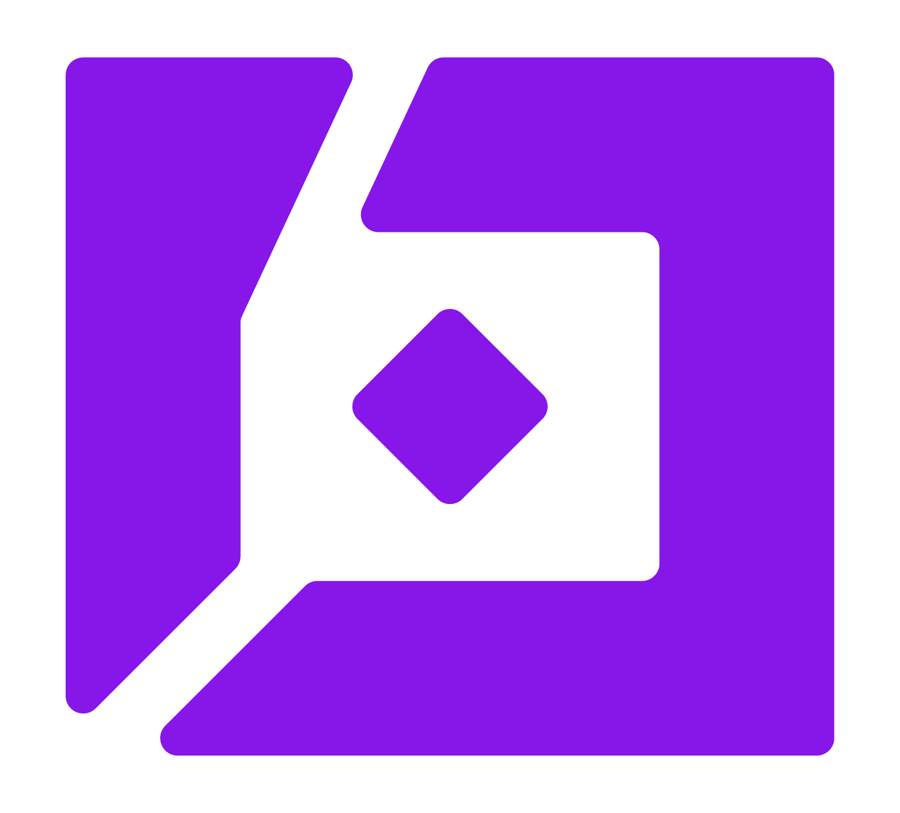

<!-- markdownlint-disable MD033 MD041 -->

<div align="center">



# Moss

### Real-time semantic search for AI agents. Sub-10 ms.

[](https://opensource.org/licenses/BSD-2-Clause)
[](https://pypi.org/project/inferedge-moss/)
[](https://pepy.tech/project/inferedge-moss-core)
[](https://www.npmjs.com/package/@inferedge/moss)
[](https://www.npmjs.com/package/@inferedge/moss)
[](https://moss.link/discord)

[Website](https://moss.dev) · [Docs](https://docs.moss.dev) · [Discord](https://moss.link/discord) · [Blog](https://moss.dev/blog)

</div>

---

Moss is the search runtime that lives inside your Conversational AI agent.

Index documents, query them semantically, and get results back **in under 10 ms** - fast enough for real-time conversation.


## Quickstart

### Python

```bash
pip install inferedge-moss
```

```python
from inferedge_moss import MossClient, QueryOptions

client = MossClient("your_project_id", "your_project_key")

# Create an index and add documents
await client.create_index("support-docs", [
    {"id": "1", "text": "Refunds are processed within 3-5 business days."},
    {"id": "2", "text": "You can track your order on the dashboard."},
    {"id": "3", "text": "We offer 24/7 live chat support."},
])

# Load and query — results in <10 ms
await client.load_index("support-docs")
results = await client.query("support-docs", "how long do refunds take?", QueryOptions(top_k=3))

for doc in results.docs:
    print(f"[{doc.score:.3f}] {doc.text}")  # Returned in {results.time_taken_ms}ms
```

### TypeScript

```bash
npm install @inferedge/moss
```

```typescript
import { MossClient } from "@inferedge/moss";

const client = new MossClient("your_project_id", "your_project_key");

// Create an index and add documents
await client.createIndex("support-docs", [
  { id: "1", text: "Refunds are processed within 3-5 business days." },
  { id: "2", text: "You can track your order on the dashboard." },
  { id: "3", text: "We offer 24/7 live chat support." },
]);

// Load and query — results in <10 ms
await client.loadIndex("support-docs");
const results = await client.query("support-docs", "how long do refunds take?", { topK: 3 });

results.docs.forEach((doc) => {
  console.log(`[${doc.score.toFixed(3)}] ${doc.text}`); // Returned in ${results.timeTakenInMs}ms
});
```

> Get your project credentials at [moss.dev](https://moss.dev) - free tier available.

## Why Moss?

**Vector databases were built for batch analytics. Moss was built for real-time agents.**

If you're building a voice bot, a copilot, or any AI system that talks to humans, you need retrieval that keeps up with conversation. A 200-500 ms round trip to a vector database kills the experience. Moss delivers results in single-digit milliseconds - fast enough that retrieval disappears from the latency budget.

<!-- > [Reproduce these benchmarks →](./benchmarks/) -->

Moss isn't a database! It's a **search runtime**. You don't manage clusters, tune HNSW parameters, or worry about sharding. You index documents, load them into the runtime, and query. That's it.

## Features

- **Sub-10 ms semantic search** - p99 of 8 ms
- **Built-in embedding models** - no OpenAI key required (or bring your own)
- **Metadata filtering** - filter by `$eq`, `$and`, `$in`, `$near` operators
- **Document management** - add, upsert, retrieve, and delete documents
- **Python + TypeScript SDKs** - async-first, type-safe
- **Framework integrations** - LangChain, DSPy, Pipecat, LiveKit, LlamaIndex

## Examples

This repo contains working examples you can copy straight into your project:

```text
examples/
├── python/                  # Python SDK samples
│   ├── load_and_query_sample.py
│   ├── comprehensive_sample.py
│   ├── custom_embedding_sample.py
│   └── metadata_filtering.py
├── javascript/              # TypeScript SDK samples
│   ├── load_and_query_sample.ts
│   ├── comprehensive_sample.ts
│   └── custom_embedding_sample.ts
└── cookbook/                # Framework integrations
    ├── langchain/           # LangChain retriever
    └── dspy/                # DSPy module

apps/
├── next-js/                 # Next.js semantic search UI
├── pipecat-moss/            # Pipecat voice agent with Moss retrieval
├── livekit-moss-vercel/     # LiveKit voice agent on Vercel
└── docker/                  # Dockerized examples (ECS/K8s pattern)
```

### Run the Python examples

```bash
cd examples/python
pip install -r requirements.txt
cp ../../.env.example .env   # Add your credentials
python load_and_query_sample.py
```

### Run the TypeScript examples

```bash
cd examples/javascript
npm install
cp ../../.env.example .env   # Add your credentials
npx tsx load_and_query_sample.ts
```

### Run the Next.js app

```bash
cd apps/next-js
npm install
cp ../../.env.example .env   # Add your credentials
npm run dev                  # Open http://localhost:3000
```

### Run the Pipecat voice agent

Sub-10 ms retrieval plugged into [Pipecat's](https://github.com/pipecat-ai/pipecat) real-time voice pipeline — a customer support agent that actually keeps up with conversation.

```bash
cd apps/pipecat-moss/pipecat-quickstart
# See README for setup and Pipecat Cloud deployment
```

## SDK Reference

### Python (`inferedge-moss`)

```python
from inferedge_moss import MossClient, DocumentInfo, QueryOptions, MutationOptions, GetDocumentsOptions

client = MossClient(project_id, project_key)

# Index management
await client.create_index(name, documents, model_id="moss-minilm")
await client.get_index(name)
await client.list_indexes()
await client.delete_index(name)

# Document operations
await client.add_docs(name, documents, MutationOptions(upsert=True))
await client.get_docs(name)
await client.get_docs(name, GetDocumentsOptions(doc_ids=["id1", "id2"]))
await client.delete_docs(name, ["id1", "id2"])

# Search
await client.load_index(name)
results = await client.query(name, "your query", QueryOptions(top_k=5))
# results.docs[0].id, .text, .score, .metadata
# results.time_taken_ms
```

### TypeScript (`@inferedge/moss`)

```typescript
import { MossClient, DocumentInfo } from "@inferedge/moss";

const client = new MossClient(projectId, projectKey);

// Index management
await client.createIndex(name, documents, { modelId: "moss-minilm" });
await client.getIndex(name);
await client.listIndexes();
await client.deleteIndex(name);

// Document operations
await client.addDocs(name, documents, { upsert: true });
await client.getDocs(name);
await client.getDocs(name, { docIds: ["id1", "id2"] });
await client.deleteDocs(name, ["id1", "id2"]);

// Search
await client.loadIndex(name);
const results = await client.query(name, "your query", { topK: 5 });
// results.docs[0].id, .text, .score, .metadata
// results.timeTakenInMs
```

## Integrations

| Framework | Status | Example |
|-----------|--------|---------|
| [LangChain](https://github.com/langchain-ai/langchain) | Available | [`examples/cookbook/langchain/`](examples/cookbook/langchain/) |
| [DSPy](https://github.com/stanfordnlp/dspy) | Available | [`examples/cookbook/dspy/`](examples/cookbook/dspy/) |
| [Pipecat](https://github.com/pipecat-ai/pipecat) | Available | [`apps/pipecat-moss/`](apps/pipecat-moss/) |
| [LiveKit](https://github.com/livekit/livekit) | Available | [`apps/livekit-moss-vercel/`](apps/livekit-moss-vercel/) |
| [Next.js](https://nextjs.org) | Available | [`apps/next-js/`](apps/next-js/) |
| [VitePress](https://vitepress.dev) | Available | [`packages/vitepress-plugin-moss/`](packages/vitepress-plugin-moss/) |
| [Vercel AI SDK](https://sdk.vercel.ai) | Coming soon | — |
| [CrewAI](https://github.com/crewAIInc/crewAI) | Coming soon | — |

## Architecture

```
┌─────────────────────────────────────────────────┐
│                  Your Application               │
│         (Voice bot, Copilot, Chat agent)        │
└────────────────────┬────────────────────────────┘
                     │
          ┌──────────▼──────────┐
          │     Moss SDK        │
          │(Python / TypeScript)│
          └──────────┬──────────┘
                     │  HTTPS
          ┌──────────▼──────────┐
          │   Moss Runtime      │
          │  ┌───────────────┐  │
          │  │  Embedding    │  │
          │  │  Engine       │  │
          │  └───────┬───────┘  │
          │  ┌───────▼───────┐  │
          │  │  Search       │  │
          │  │  Runtime      │◄─┼── Sub-10 ms queries
          │  └───────────────┘  │
          └─────────────────────┘
```

The SDKs in this repo are thin clients that talk to the Moss runtime over HTTPS. The runtime handles embedding, indexing, and search — you don't need to manage any infrastructure.

## Contributing

We welcome contributions! Here's where the community can have the most impact:

- **New SDK bindings** — Swift, Go, Elixir,...
- **Framework integrations** — Vercel AI SDK, CrewAI, Haystack, AutoGen
- **Reranking support** — plug in cross-encoder rerankers
- **Doc-parsing connectors** — PDF, DOCX, HTML, Markdown ingestion
- **Examples and tutorials** — if you build something with Moss, we'd love to feature it

See our [Contributing Guide](CONTRIBUTING.md) for setup instructions and our [Roadmap](ROADMAP.md) for what's planned.

Check out issues labeled [`good first issue`](https://github.com/usemoss/moss/labels/good%20first%20issue) to get started.

## Community

- [Discord](https://moss.link/discord) — ask questions, share what you're building
- [GitHub Issues](https://github.com/usemoss/moss/issues) — bug reports and feature requests
- [Twitter](https://x.com/usemoss) — announcements and updates

## License

[BSD 2-Clause License](LICENSE) — the SDKs, examples, and integrations in this repo are fully open source.

---

<div align="center">
  <sub>Built by the team at <a href="https://moss.dev">Moss</a> · Backed by <a href="https://www.ycombinator.com">Y Combinator</a></sub>
</div>