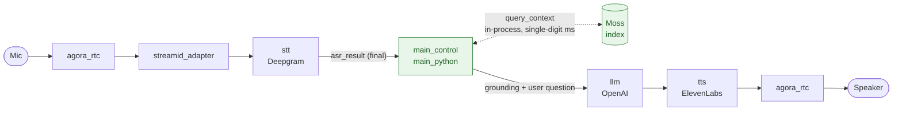
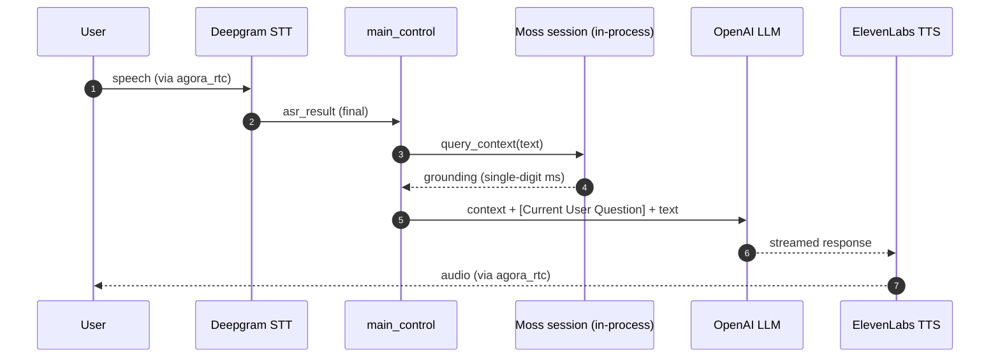

# Voice Assistant with Moss (TEN Framework)

A real-time voice agent built on the [TEN Framework](https://github.com/ten-framework/ten-framework) that grounds every answer in a [Moss](https://moss.dev) session. On each final ASR transcript, the control extension queries Moss for session-scoped context (single-digit milliseconds, in-process) and injects it into the LLM prompt before the model responds, so answers reflect your knowledge base with no perceptible added latency.

The integration is powered by the [`ten-moss`](https://pypi.org/project/ten-moss/) package (`MossSessionManager`) and lives entirely in the `main_python` control extension.

| Role | Component |
| --- | --- |
| Transport | Agora RTC |
| Speech-to-text | Deepgram |
| LLM | OpenAI |
| Text-to-speech | ElevenLabs |
| Grounding | Moss (in-process session) |

## Architecture



Everything on the retrieval path runs inside the agent process. There is no network hop between the transcript arriving and the grounded prompt reaching the LLM.

### Anatomy of a turn



## The Moss delta

The difference from the stock TEN voice assistant is small and lives in three places in `main_python`:

| Location | Change |
| --- | --- |
| `config.py` | `MainControlConfig` inherits `MossSessionConfig` (the `moss_*` properties). |
| `extension.py` (`on_init`) | Opens the Moss session via `MossSessionManager.from_config(...).open()`, best-effort. |
| `extension.py` (`_on_asr_result`) | Calls `query_context(text)` and prepends the grounding to the user's turn. |

## Prerequisites

- A **TEN Framework checkout**. This example references shared TEN extensions via relative paths (`../../../ten_packages/extension/...`) and runs with TEN's own tooling, so it lives inside a TEN Framework repo. It ships the TEN app (`tenapp/`), not the repo-level run harness (playground, server, Taskfile, Dockerfile), which the TEN Framework provides.
- A **Moss** project (`MOSS_PROJECT_ID` / `MOSS_PROJECT_KEY`) from [moss.dev](https://moss.dev).
- Provider keys: **Agora** (transport), **Deepgram** (STT), **OpenAI** (LLM), **ElevenLabs** (TTS).

## Quick start

1. **Build the demo knowledge index** (from this directory; needs only the Moss SDK):

   ```bash
   cp .env.example .env      # fill in MOSS_PROJECT_ID / MOSS_PROJECT_KEY / MOSS_INDEX_NAME
   python create_index.py    # reads data/knowledge.jsonl, creates MOSS_INDEX_NAME
   ```

2. **Drop the app into a TEN checkout.** Create an example dir at `ten-framework/ai_agents/agents/examples/voice-assistant-with-moss/` by copying the sibling `voice-assistant` example (for its Taskfile, `scripts/`, and Dockerfile run harness), then replace that copy's `tenapp/` with this repo's `tenapp/`. `main_python` depends on [`ten-moss`](https://pypi.org/project/ten-moss/) (listed in `main_python/requirements.txt`), so `task install` pulls it from PyPI automatically.

3. **Run with TEN's tooling** from that example directory (`task install && task run`, per the TEN docs), with the `MOSS_*` vars from step 1 plus the provider keys from Prerequisites (Agora, Deepgram, OpenAI, ElevenLabs). Open the TEN playground at http://localhost:3000, select the **`voice_assistant`** graph (or open `?graph=voice_assistant`), and ask something covered by `data/knowledge.jsonl`, for example *"how long do refunds take?"*, to hear grounded answers.

## Measure the latency

Every turn, the control extension logs the retrieval cost using the SDK's own `SearchResult.time_taken_ms` (surfaced by `ten-moss` as `last_time_taken_ms`), with the wall clock alongside for reference:

```
[retrieval-latency] backend=moss(in-process) time_taken_ms=2 (wall_clock=64ms)
```

In the playground transcript you see, per turn, what Moss retrieved plus the SDK `time_taken_ms`, followed by the LLM's answer:

```
🔎 Moss · retrieved in 2 ms (SDK time_taken_ms)
   Relevant knowledge from Moss: [1] Refunds are processed within 3-5 business days…
<the assistant's spoken answer>
```

The extension also emits a per-turn latency breakdown, both as a grep-able log line and as a note in the transcript, so you can see where each turn's time goes:

```
[latency-breakdown] turn=3 moss_retrieval_ms=2 llm_ttft_ms=480 llm_total_ms=1150 turn_total_ms=1160
```

| Field | Meaning |
| --- | --- |
| `moss_retrieval_ms` | The SDK's `SearchResult.time_taken_ms` (in-process retrieval engine time). |
| `llm_ttft_ms` | Time to the LLM's first token after dispatch. |
| `llm_total_ms` | Full LLM generation for the turn. |
| `turn_total_ms` | ASR-final to LLM-final (the whole control-side turn). |

ASR timing appears in the Deepgram STT extension logs and TTS audio-out in the ElevenLabs TTS logs (both per turn in the worker log), so between those and the lines above you get the full component-by-component breakdown.

### Simulate a remote store

If you just want to hear the effect in this one agent, set `moss_simulate_remote_ms` on the `main_control` node in `tenapp/property.json` to a remote-like latency and re-run `task run`:

| Value | Behavior |
| --- | --- |
| `0` | Moss in-process (~2 ms); the agent replies immediately. |
| `400` | Same agent, same answer, but it audibly pauses ~400 ms before every reply. |

## Configuration

Moss is configured on the `main_control` node in `tenapp/property.json` (env-substituted):

| Property | Default | Description |
| --- | --- | --- |
| `moss_project_id` | `${env:MOSS_PROJECT_ID}` | Moss project ID. |
| `moss_project_key` | `${env:MOSS_PROJECT_KEY}` | Moss project key (kept masked in logs). |
| `moss_index_name` | `${env:MOSS_INDEX_NAME}` | Index to query. |
| `moss_model_id` | `moss-minilm` | Embedding model; empty string adopts the stored index's model. |
| `moss_top_k` | `3` | Results retrieved per query. |
| `moss_alpha` | `0.8` | Hybrid search weighting (0.0 to 1.0). |
| `moss_context_header` | `Relevant knowledge from Moss:` | Header prepended to the injected grounding. |
| `moss_max_context_chars` | `2000` | Cap on the injected grounding block; `0` means unlimited. |
| `enable_moss` | `true` | Set to `false` to run the plain voice assistant with no grounding. |
| `moss_simulate_remote_ms` | `0` | Artificial delay to imitate a slow remote store. |

## Provenance

The `tenapp/` baseline (graph, `main_python` control extension, agent runtime, scripts) is vendored from the TEN Framework `voice-assistant` example at commit [`c385d27`](https://github.com/ten-framework/ten-framework/tree/c385d2724a1f3e6ac4ee0b81fcc7dada8346c0e0/ai_agents/agents/examples/voice-assistant), licensed under **Apache-2.0** (headers preserved). Only the Moss delta described above is Moss-authored.

Two small correctness patches were applied on top of the vendored baseline: `agent/decorators.py` fixes the `agent_event_handler` annotation to `type[AgentEvent]`, and `extension.py` parses `session_id` defensively so a non-numeric value cannot crash the ASR handler.

## Testing status

The `ten-moss` package is covered by offline unit tests (`packages/ten-moss/tests/`). This end-to-end app is **not** run in CI; it requires the TEN toolchain plus paid Agora, Deepgram, OpenAI, and ElevenLabs credentials, so it is validated manually via the steps above.
