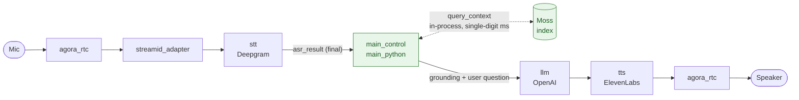

# Voice Assistant with Moss (TEN Framework)

A real-time voice agent built on the [TEN Framework](https://github.com/ten-framework/ten-framework) that grounds answers in a [Moss](https://moss.dev) session. Two graphs, one `tenapp/`:

| Graph | Playground | What happens on ASR-final |
| --- | --- | --- |
| `voice_assistant` (default, `auto_start: true`) | `?graph=voice_assistant` | ambient: `query_context` then prepend |
| `voice_assistant_tools` | `?graph=voice_assistant_tools` | tool-call: raw transcript to the LLM; `main_control` self-registers `search_knowledge_base` and handles `tool_call` in-process |

Both graphs use the same index and the same 10 FAQs in `data/knowledge.jsonl`. There is no extra extension and no hop to `apps/agora-moss` MCP.

The integration is powered by the [`ten-moss`](https://pypi.org/project/ten-moss/) package (`MossSessionManager`) and lives entirely in the `main_python` control extension.

| Role | Component |
| --- | --- |
| Transport | Agora RTC |
| Speech-to-text | Deepgram |
| LLM | OpenAI |
| Text-to-speech | ElevenLabs |
| Grounding | Moss (in-process session) |

## Architecture


```mermaid
flowchart LR
    mic(["Mic"]) --> rtc_in["agora_rtc"]
    rtc_in --> adapter["streamid_adapter"]
    adapter --> stt["stt<br/>Deepgram"]
    stt -- "asr_result (final)" --> ctl["main_control<br/>main_python"]
    ctl <-. "query_context<br/>in-process, single-digit ms" .-> idx[("Moss<br/>index")]
    ctl -- "grounding + user question" --> llm["llm<br/>OpenAI"]
    llm --> tts["tts<br/>ElevenLabs"]
    tts --> rtc_out["agora_rtc"]
    rtc_out --> spk(["Speaker"])

    classDef moss fill:#e8f5e9,stroke:#2e7d32,color:#1b5e20
    class ctl,idx moss
```

## What's in this directory

This example ships the TEN app plus a small index builder; the run harness (playground, server, Taskfile, Dockerfile) comes from the TEN Framework, so `tenapp/` drops into any TEN checkout.

- `tenapp/`: the TEN app, i.e. the two graphs in `property.json` and the `main_python` control extension that carries the Moss delta.
- `create_index.py` + `data/knowledge.jsonl`: build the demo Moss index.
- `bench/`: offline gold-phrase table (ambient / tool / no-Moss). No mic.
- `.env.example`: every credential the agent needs.

## Prerequisites

- A **TEN Framework checkout**. This example runs with TEN's tooling and references shared TEN extensions by relative path (`../../../ten_packages/extension/...`), so it must live inside a TEN Framework repo.
- A **Moss** project (`MOSS_PROJECT_ID` / `MOSS_PROJECT_KEY`) from [moss.dev](https://moss.dev).
- Provider keys: **Agora** (transport), **Deepgram** (STT), **OpenAI** (LLM), **ElevenLabs** (TTS).

## Quick start

1. **Build the demo knowledge index** (from this directory; needs only the Moss SDK):

   ```bash
   pip install moss python-dotenv   # the Moss SDK (+ python-dotenv to load .env)
   cp .env.example .env             # fill in MOSS_PROJECT_ID / MOSS_PROJECT_KEY / MOSS_INDEX_NAME
   python create_index.py           # reads data/knowledge.jsonl, creates MOSS_INDEX_NAME
   ```

2. **Drop the app into a TEN checkout**:

   ```bash
   ./setup.sh /path/to/ten-framework
   ```

   The script reuses the sibling `voice-assistant` example's harness (Taskfile, `scripts/`, Dockerfile), swaps in this `tenapp/`, and seeds `ai_agents/.env` from this directory's `.env` if you created one in step 1. To do it by hand instead:

   ```bash
   cd ten-framework/ai_agents/agents/examples
   cp -r voice-assistant voice-assistant-with-moss        # reuse its Taskfile, scripts/, Dockerfile
   rm -rf voice-assistant-with-moss/tenapp
   cp -r /path/to/moss/apps/ten-moss/tenapp voice-assistant-with-moss/tenapp
   ```

   `main_python` depends on [`ten-moss`](https://pypi.org/project/ten-moss/) (listed in `main_python/requirements.txt`), so `task install` pulls it from PyPI automatically. `task install` also pre-downloads the `moss-minilm` embedding model (when the `MOSS_*` env vars are set) so the first agent session does not have to.

3. **Run with TEN's tooling** from that example directory (`task install && task run`, per the TEN docs), with the `MOSS_*` vars from step 1 plus the provider keys from Prerequisites (Agora, Deepgram, OpenAI, ElevenLabs). Open the TEN playground at http://localhost:3000. The default graph is **`voice_assistant`** (ambient). Switch with `?graph=voice_assistant` or `?graph=voice_assistant_tools`. Ask something covered by `data/knowledge.jsonl`, for example *"how long do refunds take?"*.

   **Apple Silicon note:** TEN's `ten_agent_build` dev image is amd64-only. On colima, start the VM with Rosetta (`colima start --vz-rosetta`); under plain qemu emulation the Go toolchain segfaults during `task install`. Docker Desktop and OrbStack enable Rosetta by default.

## Under the hood

The Moss delta lives in `main_python`:

| Location | What it does |
| --- | --- |
| `config.py` | `moss_mode`: `ambient` (default) or `tool`. |
| `extension.py` `on_init` | Open `MossSessionManager`. In tool mode, register `search_knowledge_base`. |
| `extension.py` `_on_asr_result` | Ambient: `query_context` then prepend. Tool: send the raw transcript. |
| `extension.py` `on_cmd` | Tool: `query_context(arguments.query)` and return `{type: "llmresult", content: grounding}`. |
| `tenapp/property.json` | `voice_assistant` (ambient, auto-start) and `voice_assistant_tools`. |

## Measure the latency

Logs use the SDK `SearchResult.time_taken_ms` (`ten-moss.last_time_taken_ms`), plus wall clock:

```
[retrieval-latency] backend=moss(in-process) time_taken_ms=2 (wall_clock=64ms)
```

In the playground transcript you see, per turn, what Moss retrieved plus the SDK `time_taken_ms`, followed by the LLM's answer:

```
🔎 Moss · retrieved in 2 ms (SDK time_taken_ms)
   Relevant knowledge from Moss: [1] Refunds are processed within 3-5 business days…
<the assistant's spoken answer>
```

Per-turn breakdown:

```
[latency-breakdown] turn=3 moss_retrieval_ms=2 llm_ttft_ms=480 llm_total_ms=1150 turn_total_ms=1160
```

| Field | Meaning |
| --- | --- |
| `moss_retrieval_ms` | The SDK's `SearchResult.time_taken_ms` (in-process retrieval engine time). |
| `llm_ttft_ms` | Time to the LLM's first token after dispatch. |
| `llm_total_ms` | Full LLM generation for the turn. |
| `turn_total_ms` | ASR-final to LLM-final (the whole control-side turn). |

ASR timing is in the Deepgram logs; TTS audio-out is in the ElevenLabs logs.

## Configuration

Moss is configured on the `main_control` node in `tenapp/property.json` (env-substituted):

| Property | Default | Description |
| --- | --- | --- |
| `moss_project_id` | `${env:MOSS_PROJECT_ID}` | Moss project ID. |
| `moss_project_key` | `${env:MOSS_PROJECT_KEY}` | Moss project key (kept masked in logs). |
| `moss_index_name` | `${env:MOSS_INDEX_NAME}` | Index to query. |
| `moss_model_id` | `moss-minilm` | Embedding model; empty string adopts the stored index's model. |
| `moss_top_k` | `3` | Results retrieved per query. |
| `moss_alpha` | `0.8` | Hybrid search weighting (0.0 to 1.0). |
| `moss_context_header` | `Relevant knowledge from Moss:` | Header prepended to the injected grounding. |
| `moss_max_context_chars` | `2000` | Cap on the injected grounding block; `0` means unlimited. |
| `enable_moss` | `true` | Set to `false` to run the plain voice assistant with no grounding. |
| `moss_mode` | `ambient` | `ambient` prepends on ASR-final. `tool` registers `search_knowledge_base` and does not prepend. |

## Offline bench

No Agora, no Deepgram, no mic. Gold phrases are the 10 FAQs.

```bash
python bench/run.py --echo-grounding
```

See `bench/README.md`.

## Provenance

The `tenapp/` baseline (graph, `main_python` control extension, agent runtime, scripts) is vendored from the TEN Framework `voice-assistant` example at commit [`c385d27`](https://github.com/ten-framework/ten-framework/tree/c385d2724a1f3e6ac4ee0b81fcc7dada8346c0e0/ai_agents/agents/examples/voice-assistant), licensed under **Apache-2.0** (headers preserved). Only the Moss delta described above is Moss-authored.

Three small patches were applied on top of the vendored baseline: `agent/decorators.py` fixes the `agent_event_handler` annotation to `type[AgentEvent]`; `extension.py` parses `session_id` defensively so a non-numeric value cannot crash the ASR handler; and `scripts/install_python_deps.sh` fails fast (`set -euo pipefail`) and pre-warms the `moss-minilm` model cache, because two workers racing the first download corrupt the cache and grounding then silently degrades to an ungrounded assistant.

## Testing status

The `ten-moss` package is covered by offline unit tests (`packages/ten-moss/tests/`). Graph contract tests and `bench/run.py --echo-grounding` run in CI without Agora/Deepgram/LLM keys. The live voice loop is **not** in CI; it needs the TEN toolchain plus paid Agora, Deepgram, OpenAI, and ElevenLabs credentials.
