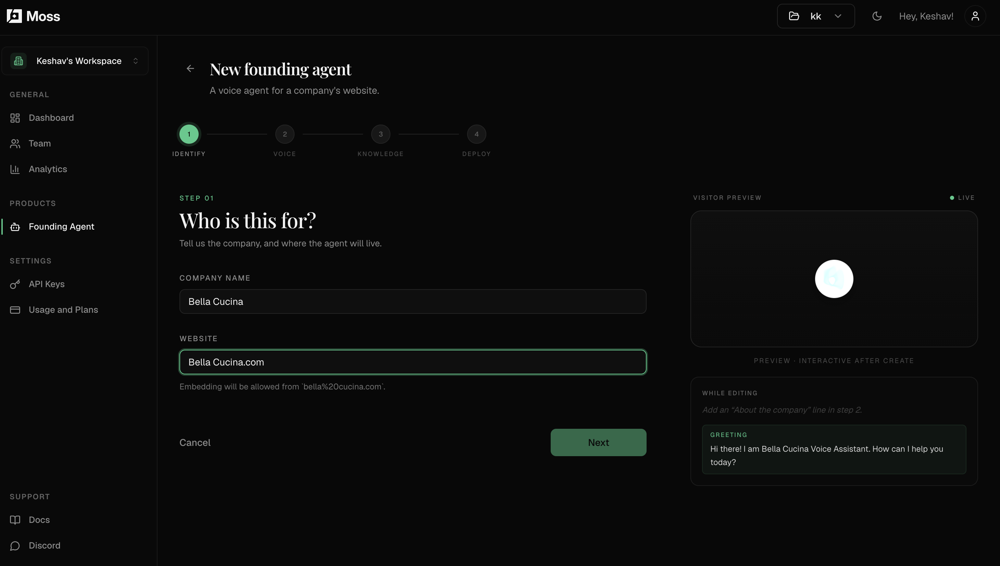
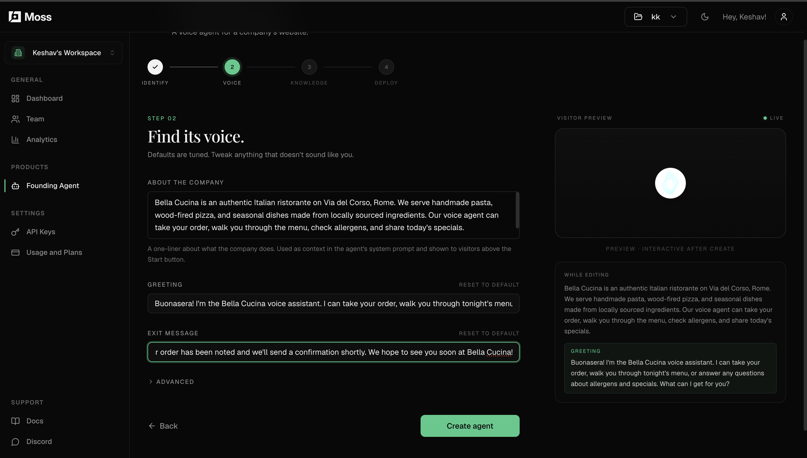
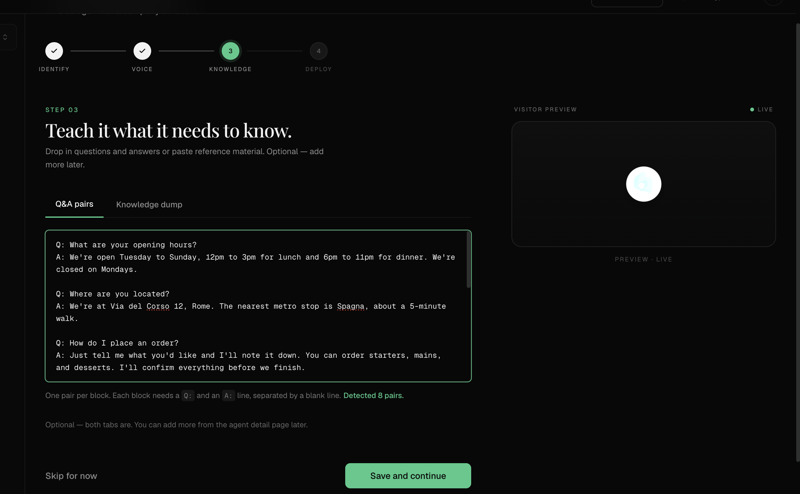

# Bella Cucina — Voice Ordering Agent Powered by Moss Founding Agent

A Next.js demo that lets restaurant visitors place orders and ask menu questions by voice. Powered by the [Moss Founding Agent](https://docs.moss.dev), a drop-in voice AI widget backed by your own knowledge base.

**What the demo does:**
- Renders a full restaurant landing page with menu
- Adds a voice bubble (bottom-right corner) that visitors click to start talking
- The agent answers menu questions, takes orders, checks allergens, and handles FAQs — all from the knowledge you give it

---

## What you'll need

- Node.js 18+
- A free [Moss account](https://moss.dev) — get your API keys from the dashboard

---

## Part 1 — Create your agent on the Moss dashboard

Go to [moss.dev](https://moss.dev), sign in, and create a new Founding Agent. The setup wizard has four steps.

---

### Step 1 — Identify and Naming

Give your agent a name. After creation the dashboard shows your credentials. Also you will get APIs in below format to use.



| Key | Starts with | Where it goes |
|-----|-------------|---------------|
| **API Key** | `sk_...` | Server only — never expose to the browser |
| **Publishable Key** | `pk_...` | Safe for the browser |

---

### Step 2 — Voice: tell it who it is

This is the most important step. It controls the agent's personality, context, and how it opens and closes every call.



Fill in the three fields like this for Bella Cucina:

**About the company**
```
Bella Cucina is an authentic Italian ristorante on Via del Corso, Rome. We serve
handmade pasta, wood-fired pizza, and seasonal dishes made from locally sourced
ingredients. The voice agent can take orders, walk visitors through the menu,
check allergens, and share today's specials.
```

**Greeting**
```
Buonasera! I'm the Bella Cucina voice assistant. I can take your order, walk you
through tonight's menu, or answer any questions about allergens and specials.
What can I get for you?
```

**Exit message**
```
Grazie mille! Your order has been noted and we'll send a confirmation shortly.
We hope to see you soon at Bella Cucina!
```

Click **Create agent** when done.

---

### Step 3 — Knowledge: teach it the menu

Paste Q&A pairs so the agent can answer questions accurately. One blank line between each pair.



Copy and paste this starter knowledge base:

```
Q: What are your opening hours?
A: We're open Tuesday to Sunday, 12pm–3pm for lunch and 6pm–11pm for dinner. Closed Mondays.

Q: Where are you located?
A: Via del Corso 12, Rome. Nearest metro is Spagna, about a 5-minute walk.

Q: What starters do you have?
A: Bruschetta al Pomodoro ($9), Burrata e Prosciutto ($14), and Zuppa del Giorno — today's soup ($8).

Q: What are the main courses?
A: Tagliatelle al Ragù ($22), Risotto ai Funghi ($20), Branzino al Forno ($28), and Pizza Margherita ($16).

Q: What desserts do you have?
A: Tiramisù della Casa ($10) and Panna Cotta ($9).

Q: What is the soup of the day?
A: Today's Zuppa del Giorno is a roasted tomato and basil bisque, served with toasted focaccia.

Q: Do you have vegetarian options?
A: Yes — the Risotto ai Funghi and Pizza Margherita are both vegetarian.

Q: Do you have gluten-free options?
A: The Panna Cotta is gluten-free. Let us know about any allergies and we'll check with the kitchen.

Q: Does the food contain nuts?
A: No current dishes use nuts as a primary ingredient, but our kitchen handles them. Please flag severe nut allergies.

Q: Can I customise my order?
A: Absolutely — removing ingredients, adjusting portions, swapping sides. Just ask.

Q: Do you offer delivery?
A: Yes, within a 5km radius. Around 35–45 minutes. Minimum order $30.

Q: Is there a delivery fee?
A: $4 for orders under $60, free for $60 and over.

Q: Do you do takeaway?
A: Yes — ready in about 20 minutes. Collect from Via del Corso 12.

Q: What payment methods do you accept?
A: All major cards, Apple Pay, Google Pay, and cash for in-person collection.

Q: Can I cancel or change my order?
A: Within 5 minutes of placing it, yes. After that, call us directly as the kitchen will have started.
```

Hit **Save and continue** — dashboard setup is done.

---

## Part 2 — Run the Next.js demo

### Install dependencies

```bash
cd moss/examples/moss-founding-agent
npm install
```

### Add your keys

```bash
cp .env.local.example .env.local
```

Open `.env.local` and paste the keys you copied in Step 1:

```env
MOSS_FA_API_KEY=sk_your_key_here
NEXT_PUBLIC_MOSS_FA_PUBLISHABLE_KEY=pk_your_key_here
```

> **Heads up:** `.env.local` takes priority over `.env`. Always put your real keys in `.env.local`.

### Start the server

```bash
npm run dev
```

Open [http://localhost:3000](http://localhost:3000). You'll see the Bella Cucina landing page with an amber voice bubble pinned to the bottom-right corner.

**Click the bubble → agent greets you → start talking.**

---

## How it works under the hood

```
Browser                     Your Next.js server          Moss service
──────────────────────────────────────────────────────────────────────
User clicks bubble
  → POST /api/moss-token  →  createFoundingAgentSession()
                          ←  { token, serverUrl, roomName }
  ← token received
  → connects to LiveKit room (audio only)
                                                  ↕ agent joins room
  ↔ voice conversation ──────────────────────────────────────────────
```

Your `sk_` API key never leaves the server. The browser only ever sees the short-lived LiveKit token.

---

## Customising for your own restaurant

Everything is in [`app/page.tsx`](app/page.tsx):

| What to change | Where in the file |
|---|---|
| Restaurant name & location | `<nav>` section |
| Menu items and prices | `MENU` array at the top |
| Suggested voice prompts | `PROMPTS` array at the top |
| Bubble colour | `<MossFoundingAgentBubble color="amber" />` |

**Available bubble colours:** `violet` · `cobalt` · `teal` · `emerald` · `coral` · `amber`

To update the menu or FAQs later, just edit the knowledge base in the Moss dashboard — no code redeploy needed.

---

## Project structure

```
moss-founding-agent/
├── app/
│   ├── api/moss-token/route.ts   # Mints LiveKit session token server-side
│   ├── globals.css               # Tailwind v4 + LiveKit styles
│   ├── layout.tsx                # Page shell and metadata
│   └── page.tsx                  # Restaurant landing page + voice bubble
├── demo_images/                  # Dashboard setup screenshots
│   ├── step_1.png
│   ├── step_2.png
│   └── step_3.png
├── .env.local.example            # Copy to .env.local and fill in your keys
├── next.config.ts
└── package.json
```
