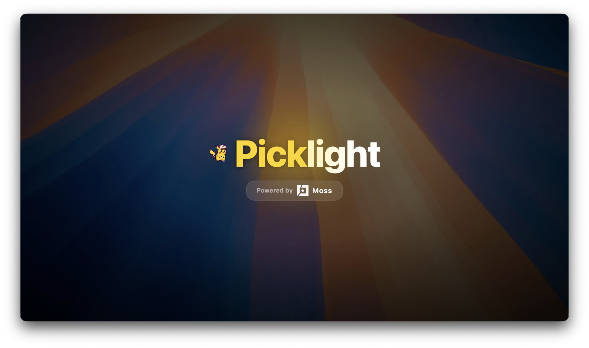

# Picklight

<div align="center">



</div>

Native macOS menu bar app for semantic file search powered by [Moss](https://moss.dev).

- **Hotkey:** ⌘⇧M to open search
- **Pet:** Capvolt animates on your desktop
- **Privacy:** Files are indexed and stored on this Mac. Moss API keys authenticate semantic search locally; nothing is uploaded to Moss cloud.

**Works immediately after Moss API keys** (and one automatic/local Python setup).

## Get running in 5 steps

1. **Clone** this repository.

2. **Open in Xcode** — the build phase creates `.venv` automatically if needed:
   ```bash
   open MossPikachu.xcodeproj
   ```
   Press **⌘R** to build and run. If Python setup fails, check the Xcode build log or run `./scripts/setup-moss-venv.sh`.

3. **Enter Moss keys** — on first launch, Picklight shows a setup window for your [moss.dev](https://moss.dev) Project ID and Project Key. Alternatively, create `.env` in the project root:
   ```bash
   cp .env.example .env
   # Edit MOSS_PROJECT_ID and MOSS_PROJECT_KEY
   ```

4. **Grant folder access** if macOS prompts for Desktop, Documents, or Downloads.

5. **Search** — click the pet or press **⌘⇧M**.

Default indexing covers **Documents, Desktop, and Downloads** only. Enable Movies, Music, Pictures, Public, or iCloud Drive in **Settings → Indexed Folders**.

## CLI bootstrap (non-Xcode)

```bash
chmod +x scripts/*.sh
./scripts/bootstrap.sh          # venv + credential check
./scripts/bootstrap.sh --smoke  # optional indexing smoke test
```

## Prerequisites

- macOS 12+
- Xcode 15+
- Python 3.10+ (used by the automatic venv setup)

## Development

```bash
chmod +x scripts/*.sh
./scripts/smoke-test-indexing.sh
./.cursor/skills/moss-pikachu/scripts/validate-phase.sh 1

# Debug logging: run with --debug in Xcode scheme
# Logs: ~/Library/Application Support/Picklight/picklight.log
```

## Architecture

- **Swift app** — Menu bar UI, FSEvents file monitor, search overlay
- **moss_worker.py** — Python subprocess using `pip install moss>=1.6.0` SessionIndex API
- **Local cache** — `~/Library/Application Support/Picklight/moss-session-cache`

## Documentation

| Doc | For |
|-----|-----|
| [how-to.md](how-to.md) | Daily use guide |

## Agent skills

Cursor agent skills live in [`.cursor/skills/`](.cursor/skills/).

## Product demo video

Picklight promo (Remotion): [`promo/`](promo/)

Pre-rendered: [`promo/picklight-promo.mp4`](promo/picklight-promo.mp4)

```bash
cd promo
npm install
npm run render   # → out/picklight-promo.mp4
```

Branding still: [`docs/project-branding.png`](docs/project-branding.png)

## Vendor

Optional reference clone of the Moss OSS repo:
```bash
git submodule add https://github.com/usemoss/moss vendor/moss
```

The app uses the **PyPI** `moss` package (not editable install from GitHub main SDK).
