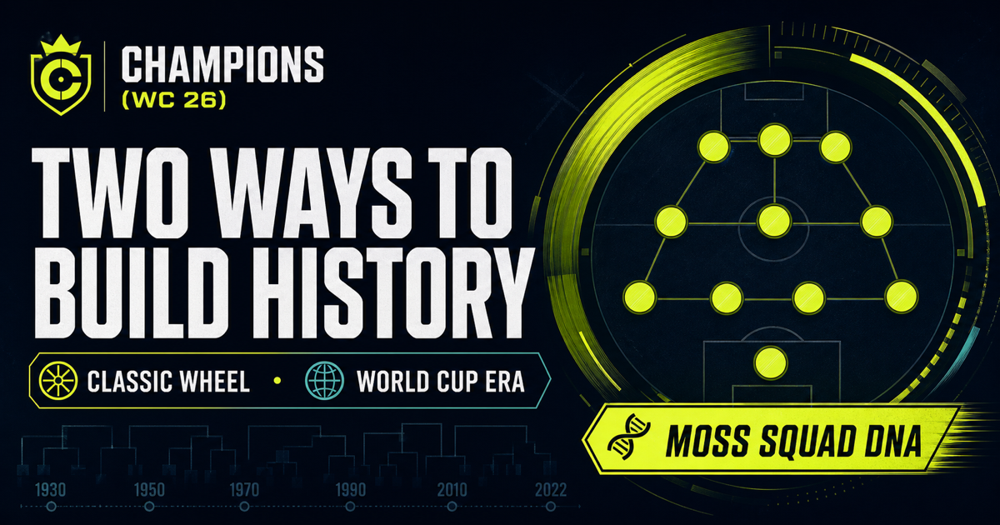
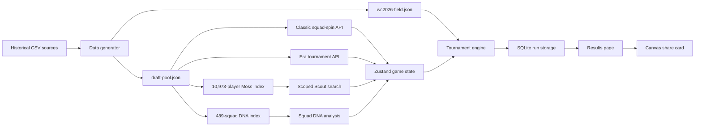

# Champions (WC 26)



**Champions (WC 26)** is a local draft-and-simulate football game built around the history of the men’s World Cup. Keep the original squad-wheel challenge or spin a different tournament year for each player in World Cup Era mode. Build an XI, reveal its closest historical **Squad DNA**, replace a team in the real 2026 field, and attempt to finish the tournament with a perfect **8–0** record.

The complete draft and simulation game runs locally with no account or external game database. Historical seed data is included in the repository, completed runs are saved to local SQLite, and an optional Moss integration adds conversational player search when the player supplies their own Moss project credentials.

> This is an unofficial fan-made project. It is not affiliated with, endorsed by, or sponsored by FIFA, any confederation, national association, player, or rights holder.

## Contents

- [Game overview](#game-overview)
- [Features](#features)
- [How to play](#how-to-play)
- [The perfect 8–0](#the-perfect-80)
- [Quick start](#quick-start)
- [Available commands](#available-commands)
- [Technology](#technology)
- [Architecture](#architecture)
- [Moss Scout](#moss-scout)
- [Historical data](#historical-data)
- [Player ratings](#player-ratings)
- [Tournament simulation](#tournament-simulation)
- [Persistence](#persistence)
- [API routes](#api-routes)
- [Project structure](#project-structure)
- [Sharing the local game](#sharing-the-local-game)
- [Production deployment](#production-deployment)
- [Testing and verification](#testing-and-verification)
- [Troubleshooting](#troubleshooting)
- [Current limitations](#current-limitations)
- [Data attribution and disclaimer](#data-attribution-and-disclaimer)

## Game overview

The game combines seven systems:

1. **Two distinct game modes:** Classic Wheel preserves the original one-player-per-squad draft. World Cup Era spins a tournament year for each pick and unlocks every country and player from that spin’s World Cup.
2. **Formation building:** Eleven players must fill the positions in a selected 4-3-3, 4-4-2, or 3-5-2.
3. **Classic rating rules:** World Cup Form preserves campaign-specific ratings; Prime Form uses one career-peak estimate for every version of a player.
4. **Contextual Moss scouting:** Classic allows one position-compatible archive replacement. Every Era search is locked to the current spin’s tournament roster.
5. **Squad DNA:** A finished XI is compared with 489 historical squads to reveal its closest football identity.
6. **2026 tournament entry:** The custom XI replaces one real nation in Groups A–L.
7. **Full tournament simulation:** The XI plays three group matches and, if qualified, five knockout rounds.

The maximum path is eight matches: three group matches plus the Round of 32, Round of 16, quarterfinal, semifinal, and final.

## Features

- Three selectable formations with different tactical modifiers
- Separate **Classic Wheel** and **World Cup Era** game modes
- Optional **World Cup Form** and **Prime Form** rating rules inside Classic
- One stable career-prime estimate for all 8,482 unique historical players
- 489 usable historical World Cup squads
- 10,973 player-tournament records
- 85 historical national-team identities
- Every men’s World Cup from 1930 through 2022
- Position-compatible formation slotting
- No repeated nation/year squad during one draft
- Eleven World Cup year spins with one complete tournament roster per pick
- One optional Moss-powered replacement after the draft
- Conversational semantic search across all 10,973 player campaigns
- Era-mode Moss recommendations strictly filtered to the current year spin
- Moss-powered Squad DNA comparison against all 489 historical squads
- Separate Scout Lab with semantic search and paginated archive browsing
- Real 48-team World Cup 2026 group field
- Full 72-match group-stage simulation
- Top-two and best-third-place qualification
- Round of 32 through the final
- Extra time and penalty shootouts
- Perfect **8–0** detection
- Stage-by-stage result reveals
- Locally persisted tournament results
- Shareable result-card generation in the browser
- Responsive dark sports-editorial interface
- Auditable data-generation and player-rating methodology

## How to play

### 1. Choose a game mode

Start at `/game` and choose one of two independent modes:

| Mode | Player pool | Draft rule | Moss search |
| --- | --- | --- | --- |
| **Classic Wheel** | All 22 World Cups | Choose World Cup Form or Prime Form, then spin 11 unused nation/year squads and take one player from each | One optional, position-compatible replacement using the selected rating rules |
| **World Cup Era** | One wheel-selected World Cup per pick | Browse every country and player in the current tournament, choose one, then spin another unused year | Recommendations are filtered to the current spin’s tournament only |

Classic remains the original game and has not been replaced by Era mode.

### 2. Choose a formation

Start at `/game` and select one of the available systems:

| Formation | Shape | Match-engine modifier |
| --- | --- | --- |
| 4-3-3 | Four defenders, three midfielders, three forwards | +3 attack |
| 4-4-2 | Four defenders, four midfielders, two forwards | +2 defense |
| 3-5-2 | Three defenders, five midfielders, two forwards | +2 attack, −2 defense |

The formation determines how many goalkeeper, defender, midfielder, and forward slots must be filled.

#### Classic rating rules

After locking a Classic formation, choose one of two rating lenses:

| Ruleset | Meaning | Example |
| --- | --- | --- |
| **World Cup Form** | The original rating calculated from that exact tournament’s appearances, goals and team finish | Lionel Messi 2010 is 77 |
| **Prime Form** | One estimated absolute career-prime rating reused across every tournament version of the player | Lionel Messi is 94 in 2006, 2010, 2014, 2018 and 2022 |

Prime Form changes only ratings. The wheel still returns the real historical roster, the one-player-per-squad rule remains, and position compatibility is unchanged. World Cup Era always uses World Cup Form.

### 3A. Build in Classic Wheel

Each spin returns one unused historical squad, such as `Brazil 2002`, `Cameroon 1990`, or `Bulgaria 1994`. Every usable squad has at least eleven players and at least one goalkeeper.

Select one player from the rolled squad. Only players compatible with at least one remaining broad-position slot are shown as eligible. After selecting a player, choose one of the highlighted formation positions to confirm the pick.

Only one player may be taken from each rolled nation/year squad.

Repeat the spin-and-pick process until all eleven positions are occupied. Draft progress is stored in browser storage, so an accidental refresh should not normally erase the current XI.

After the eleventh pick, the game opens **Moss Scout**. Enter a Moss project ID and project key, then describe the campaign you want in natural language—for example, `creative midfielder from an underdog run` or `commanding goalkeeper before 1990`.

Choose one result and replace one current player with the same broad position. Prime Form converts every Moss result to the same career-prime rating model before the transfer. The transfer is final for that run and can be used only once. You can also skip it and keep the XI produced by the wheel.

### 3B. Build in World Cup Era

For every open position, the Era wheel selects one unused men’s World Cup from 1930 through 2022. After accepting the year, the game opens that tournament’s complete archive:

- Browse every participating country.
- Search every player by name, nation, position, or inferred role.
- Filter the roster to one country.
- Select exactly one position-compatible player from that tournament.
- Switch to **Search this wheel roster** for conversational Moss recommendations.

Once the player is placed, that year is locked into the run and the game returns to the wheel. Repeat the process until eleven different tournament years have supplied one player each.

Era search uses the same 10,973-campaign Moss index but adds the current spin’s year as a mandatory metadata filter. A result from another tournament cannot enter that pick’s results or the XI.

### 4. Reveal Squad DNA

After either mode produces eleven players, enter the same Moss project credentials—or reuse the in-memory credentials already entered during scouting—and select **Reveal Squad DNA**.

The app creates or reuses a separate 489-document historical-squad index. Moss retrieves semantically relevant squads, while a deterministic football-profile comparison evaluates:

- Overall player-campaign quality
- Attacking and defensive balance
- Goalkeeper quality
- Average tournament experience
- Goals represented in the selected XI
- Attack-led, balanced, or defense-led identity

The highest combined match produces a result such as **“Your XI most closely resembles France 1998”**, a similarity score, a metric comparison, and the historical team’s finish. Squad DNA is optional so an unavailable Moss project never blocks the tournament.

### 5. Enter the 2026 field

Choose one of the 48 World Cup 2026 nations. The custom team, displayed as **Champions XI**, replaces that nation in its real group and inherits its three group opponents.

### 6. Simulate the tournament

Reveal the group stage first. If the XI qualifies, advance through each knockout round until elimination or the final. Completed results are saved automatically.

## The perfect 8–0

A run receives the **Perfect 8–0** badge only when all of the following are true:

- Champions XI wins all three group matches.
- Champions XI qualifies for and wins all five knockout matches.
- Champions XI becomes world champion.
- None of the eight victories is decided by a penalty shootout.

An extra-time victory still counts toward the perfect run. A penalty-shootout victory advances the team and counts as a win in the displayed record, but it disqualifies the run from the perfect badge.

## Quick start

### Requirements

- Node.js 22 or newer
- npm
- macOS, Linux, or Windows

### Installation

```bash
cd "/path/to/Moss Project"
npm install
npm run dev
```

Open [http://localhost:3000](http://localhost:3000), then choose **Build your XI** or go directly to [http://localhost:3000/game](http://localhost:3000/game).

The generated historical and 2026 JSON files are already included. Running the data generator is not required for normal play.

## Available commands

| Command | Purpose |
| --- | --- |
| `npm run dev` | Start the Next.js development server |
| `npm run build` | Create an optimized production build and type-check the app |
| `npm start` | Run the previously built production server |
| `npm run lint` | Run ESLint across the project |
| `npm test` | Run the data-integrity tests |
| `npm run data:generate` | Refetch and regenerate the historical pool and 2026 field |

For a production-like local run:

```bash
npm run build
npm start
```

## Technology

| Area | Technology |
| --- | --- |
| Web framework | Next.js 15 App Router |
| Language | TypeScript |
| UI | React 19 |
| Styling | Tailwind CSS 4 plus project CSS |
| Client game state | Zustand with browser persistence |
| Local results database | SQLite through `better-sqlite3` |
| Semantic player retrieval | Moss JavaScript SDK through `@moss-dev/moss` |
| Icons | Lucide React |
| Historical generation | Node.js script using source CSV files |
| Match model | Seeded Poisson goal simulation |

## Architecture



The large historical pool remains on the server. Classic requests only the squad returned by each spin. World Cup Era requests one complete tournament roster at a time, never the entire 10,973-player archive. Draft choices, used tournament years, current spin, optional Scout replacement, and Squad DNA result are maintained by Zustand, while the completed XI is sent to the simulation API only when the tournament begins.

The simulation API runs the tournament, saves the resulting object to SQLite, and returns a short run ID used by `/results/[id]`.

## Moss Scout

Moss is used for player discovery and historical Squad DNA retrieval. It does not alter the wheel, player ratings, or match simulation; the tournament engine remains deterministic for a given seed.

### The four Moss experiences

1. **Classic one-transfer phase:** `/game` opens Moss Scout after all eleven Classic slots are filled. The player may replace exactly one drafted campaign with a result sharing the same broad position.
2. **Era roster search:** World Cup Era exposes Moss beside the current spin’s roster browser. Every query includes that tournament year as a metadata filter, and the player can make exactly one compatible pick before spinning again.
3. **Squad DNA:** Both modes can search a dedicated 489-squad index after the XI is complete. The final match combines Moss relevance with numeric football-profile similarity.
4. **Scout Lab:** `/scout` is an independent sandbox. **Moss semantic search** accepts natural-language football descriptions, while **Archive browse** provides direct filters for name, nation, year, position, and sort order. Scout Lab never changes an active game.

### What happens on first connection

The player supplies `MOSS_PROJECT_ID` and `MOSS_PROJECT_KEY` through the connection form. The server then:

1. Authenticates against the supplied Moss project.
2. Looks for the requested versioned player or Squad DNA index.
3. Creates it with the `moss-minilm` model when it does not exist.
4. Uploads either 10,973 campaign documents or 489 squad-profile documents.
5. Loads the completed index into the running Node.js process.
6. Executes later hybrid semantic/keyword queries against the in-memory index, including position or year metadata filters when required.

The initial uploads and index builds can take longer than later searches. Player search and Squad DNA use two separate versioned indexes, so enabling both requires room for two Moss indexes plus their ingest/storage allowance. Loaded queries run through the in-process Moss client.

Each indexed document contains the player name, nation, tournament, position, inferred role, rating, appearances, starts, estimated minutes, goals, team finish, and source-coverage note. The complete player object is stored as an opaque Moss payload and returned with the match.

### Credential handling

- Credentials remain in React component memory for the open page and are not written to `localStorage`, Zustand, SQLite, or committed files.
- Each connect/search request sends the credentials to the app's Node.js route. The running server keeps a small in-memory Moss client cache so follow-up queries do not reload the index every time.
- Credentials are never returned in an API response or intentionally logged by the app.
- Closing/restarting the app clears the server cache. Reloading the page requires the player to enter credentials again.
- On a public deployment or tunnel, use a purpose-specific Moss project key rather than a sensitive production credential because the application host controls the server receiving it.

Moss performs retrieval, not generative AI, in this implementation. The short explanation below each result is deterministic and composed from the returned campaign data. See the official [Moss Next.js integration](https://docs.moss.dev/docs/integrations/nextjs) and [JavaScript SDK reference](https://docs.moss.dev/docs/reference/js/api) for the underlying pattern.

## Historical data

The draft pool is generated from [The Fjelstul World Cup Database](https://github.com/jfjelstul/worldcup). The generator fetches these source tables:

- `squads.csv`
- `player_appearances.csv`
- `goals.csv`
- `qualified_teams.csv`

The generator then:

1. Keeps men’s World Cup records only.
2. Joins players to their tournament squad.
3. Aggregates tournament appearances, starts, estimated minutes, and goals.
4. Adds the team’s tournament finish.
5. Computes one rating per player per tournament.
6. Infers a deterministic formation sub-position while retaining the source’s broad position.
7. Excludes incomplete squads with fewer than eleven players or no goalkeeper.

Current generated coverage:

| Measure | Count |
| --- | ---: |
| Tournaments | 22 |
| Usable squads | 489 |
| Player-tournament records | 10,973 |
| Historical nation identities | 85 |
| Earliest tournament | 1930 |
| Latest historical tournament | 2022 |

### Generated files

| File | Contents |
| --- | --- |
| `data/draft-pool.json` | Historic squads and player-tournament ratings |
| `data/wc2026-field.json` | The 48 teams, groups, FIFA ranking data, and strength ratings |
| `data/data-sources.json` | Generation time, source URLs, and coverage totals |

To refresh all generated data:

```bash
npm run data:generate
```

This command requires an internet connection and overwrites the generated JSON files with newly fetched source data.

## Player ratings

The app exposes two deliberately separate rating systems. **World Cup Form** represents performance and team success in one specific tournament. **Prime Form** is an optional Classic ruleset estimating the player’s absolute career peak.

For example, the same player can receive a different rating in two different tournaments. The inputs include:

- Tournament appearances
- Starts
- Estimated minutes
- Goals, with position-dependent weighting
- The furthest stage reached by the player’s team

World Cup Form has no manual legend boosts or fame-based overrides. Prime Form includes 101 editorial elite-player benchmarks, then applies one deterministic archive-wide fallback model to everyone else. The source `playerId` links the same person across tournaments, so each version receives an identical prime rating.

Prime examples include Pelé 96, Diego Maradona 95, Ronaldo 95, Lionel Messi 94, Cristiano Ronaldo 94 and Zinedine Zidane 94. These are independent game-design estimates rather than official FIFA or commercial video-game ratings.

Appearance-level player coverage begins in 1970 in the source data. Earlier tournaments rely mainly on squad membership, goals, and team finish, so famous pre-1970 players can look lower than expected. Exact minutes and assists are unavailable; minutes are estimated and assists are stored as `null`.

See [RATINGS.md](./RATINGS.md) for both formulas, the curated/fallback split, modifiers, sub-position inference, strength conversion, and limitations.

## Tournament simulation

### Team models

Real 2026 opponents use a single strength rating derived from the official FIFA ranking points published on 11 June 2026. The engine deterministically separates that aggregate into attack, defense, goalkeeper, and mental proxies.

Champions XI derives its model from the drafted players:

- Attack primarily uses midfielder and forward ratings.
- Defense primarily uses defender and goalkeeper ratings.
- Goalkeeper strength uses the selected goalkeeper’s rating.
- Mental strength uses the XI’s overall average.
- The chosen formation adds its tactical modifier.

Player-campaign ratings and 2026 national-team strengths are deliberately different scales. Before simulation, the engine therefore maps the custom XI’s player average onto the tournament-strength scale:

```text
team strength = clamp(58, 96, round(58 + ((player average - 55) / 37) × 38))
```

The same conversion is applied to the custom attack, defense, goalkeeper, and mental units before formation modifiers. An **84 player average becomes approximately 88 tournament strength**, making that XI a genuine contender without guaranteeing a deep run. The results UI keeps the raw player average separate from the calibrated simulation strength.

All matches are treated as neutral venue fixtures; the engine does not add artificial home advantage.

### Regulation scoring

Each team’s expected goals value is computed from its attack rating against the opponent’s defense rating. Actual goals are then sampled from a Poisson distribution. Rating differences use a steeper response than the original model, reducing upset variance while retaining believable randomness.

The simulation uses a numeric seed, making an individual generated tournament internally reproducible.

### Group stage

- Twelve groups of four teams
- Six matches per group
- Seventy-two group matches in total
- Three points for a win, one for a draw, zero for a loss
- The top two teams in every group qualify automatically
- The eight best third-place teams also qualify

The implemented group sort considers points, head-to-head outcome, goal difference, goals scored, fair-play proxy, and finally a deterministic name fallback representing lots.

Third-place teams are ranked by points, goal difference, goals scored, and fair play.

### Knockout stage

The knockout rounds are:

1. Round of 32
2. Round of 16
3. Quarterfinal
4. Semifinal
5. Final

If a knockout match is level after regulation, the engine samples an additional reduced-intensity 30-minute period. If still tied, a penalty shootout is simulated with near-even odds. Goalkeeper and mental differences can move the shootout probability within a bounded 39–61% range.

The engine simulates 103 tournament matches: 72 group matches and 31 knockout matches. A third-place playoff is intentionally not included because it does not affect the player’s championship path.

## Persistence

Completed tournament runs are stored in:

```text
.local-data/champions-wc26.sqlite
```

The directory is created automatically and excluded from Git. Each database record stores:

- Run ID
- Creation time
- Replaced 2026 nation
- Formation
- Champion and perfect-run flags
- The complete serialized result object

The results page reads this record by ID. Because the database is local, a result link such as `/results/abcd1234` works only against the same computer and database unless the app is deployed with persistent shared storage.

Draft-in-progress state is separate from SQLite and is persisted in browser storage under the `champions-wc26-game` key.

## API routes

| Route | Method | Purpose |
| --- | --- | --- |
| `/api/squads` | GET | Return a random unused historical squad |
| `/api/eras` | GET | List all tournament years or return one complete year roster, including a random wheel result |
| `/api/simulate` | POST | Validate the XI, simulate the tournament, and save the run |
| `/api/runs/[id]` | GET | Retrieve one stored tournament result |
| `/api/stats` | GET | Return local totals for runs, champions, and perfect runs |
| `/api/scout/moss` | POST | Connect credentials, create/load player or Squad DNA indexes, run filtered semantic search, and analyze an XI |
| `/api/scout/players` | GET | Paginate and filter the local archive used by Scout Lab browse mode |

## Project structure

```text
app/
  api/                     Route handlers for game and Scout operations
  disclaimer/              Attribution and legal disclaimer page
  game/                    Draft and tournament entry route
  how-to-play/             Player-facing rules
  results/[id]/            Stored result route
  scout/                   Standalone Moss Scout Lab
  globals.css              Global visual system and responsive styles
components/
  game/                    Modes, Classic/era draft phases, Squad DNA, results, and share card
  scout/                   Shared Moss search and archive browser UI
data/
  draft-pool.json          Generated historical draft data
  wc2026-field.json        Generated 2026 teams and ratings
lib/
  db.ts                    SQLite initialization and run persistence
  formations.ts            Formation slots and modifiers
  moss-scout.ts            Server-only Moss client, index lifecycle, and querying
  prime-ratings.ts         Career-prime benchmarks and archive-wide fallback model
  era-data.ts              Tournament-year summaries and complete Era rosters
  scout-data.ts            Player-document mapping and local archive browsing
  squad-dna.ts             Historical squad profiles and combined DNA ranking
  simulation.ts            Group and knockout match engine
  types.ts                 Shared TypeScript models
scripts/
  generate-data.mjs        Source-fetching and data-generation pipeline
store/
  game-store.ts            Persisted Zustand game state
tests/
  data-integrity.test.mjs  Coverage and field validation
  era-and-dna-integrity.test.mjs  Era roster and DNA source validation
  scout-integrity.test.mjs Search archive validation
RATINGS.md                 Rating methodology
```

## Sharing the local game

`http://localhost:3000` is visible only on the computer running the server. For a temporary public demo, keep `npm run dev` running and open a second terminal:

```bash
cd "/path/to/Moss Project"
npx wrangler@latest tunnel quick-start http://localhost:3000
```

The command prints a temporary URL similar to:

```text
https://random-words.trycloudflare.com
```

Anyone with that URL can access the game while both terminal processes are running and the host computer remains awake. The URL is temporary and changes when the tunnel restarts.

## Production deployment

The current app writes tournament results to a local SQLite file. A permanent host therefore needs either:

1. A long-running Node.js service with a persistent disk mounted at `.local-data`, or
2. A small persistence migration from SQLite to a hosted relational database such as Postgres or Turso.

A purely ephemeral or serverless filesystem can run the interface but will not reliably preserve result records between restarts. If persistent result links are unnecessary, storage can alternatively be changed to browser-only state.

Recommended production commands:

```bash
npm install
npm run build
npm start
```

Do not commit Moss credentials or other secrets. This app intentionally asks each player for a key at runtime; a permanent private deployment can instead be adapted to read one server-owned project from environment variables.

## Testing and verification

Run the automated checks:

```bash
npm run lint
npm test
npm run build
```

The data-integrity tests verify that:

- All 22 men’s tournaments are represented.
- The historical range begins in 1930 and ends in 2022.
- At least 480 usable historical squads are generated.
- Every included squad has at least eleven players.
- The 2026 field contains exactly 48 teams.
- Groups A–L each contain exactly four teams.
- Every 2026 team has a valid ranking and bounded strength rating.
- All 10,973 Scout campaign IDs are unique and have valid searchable fields.
- The Scout archive contains goalkeeper, defender, midfielder, and forward records.
- World Cup Era exposes all 22 tournaments, exactly 489 squads, and all 10,973 player campaigns.
- Every Squad DNA source squad has at least eleven rated players and a goalkeeper.
- Prime ratings resolve consistently by player identity across every tournament version.

The full simulation path has also been exercised through an eight-game championship run, including SQLite save and retrieval.

## Troubleshooting

### The page stays on “Opening the draft room”

Hard-refresh the browser first:

- macOS: `Cmd + Shift + R`
- Windows/Linux: `Ctrl + Shift + R`

If that does not resolve it, stop the development server, clear the generated Next.js cache, and restart:

```bash
rm -rf .next
npm run dev
```

Do not run `npm run build` at the same time as `npm run dev`; both commands write to `.next` and can interfere with one another.

### Port 3000 is already in use

Stop the other process using the port, or start the game on another port:

```bash
npm run dev -- --port 3001
```

Then open `http://localhost:3001`.

### SQLite native-module error

Make sure Node.js 22+ is installed, remove the dependency directory, and reinstall:

```bash
rm -rf node_modules
npm install
```

`better-sqlite3` includes native code and must be installed for the active operating system and Node version.

### A stored result link returns “Run not found”

Result IDs are stored in the local SQLite database. The link will not resolve on another machine, after the database is deleted, or on a deployment that does not preserve `.local-data`.

### The data generator fails

Confirm that the machine has internet access and that GitHub, FIFA, and Wikipedia are reachable. Normal gameplay does not require regeneration because generated files are committed to the repository.

### Moss rejects the project ID or key

Copy both values from the [Moss portal](https://portal.usemoss.dev) without leading or trailing spaces. The project key—not a publishable browser key—is required because Moss runs in the server route. Reloading the page deliberately clears the entered values.

### The first Moss connection or Squad DNA reveal takes a long time

The first Scout connection uploads and builds an index for 10,973 campaign documents. The first Squad DNA reveal separately builds a 489-document squad index. Keep the page open until each completes. Later operations reuse the versioned indexes and loaded in-process client. If either fails, confirm the project has room for the required indexes and enough ingest/storage allowance; Archive Browse and the non-Moss game flow remain available.

## Current limitations

- World Cup Form describes one campaign; Prime Form is an opinionated estimate because complete club-career data is unavailable across the entire 1930–2022 archive.
- Appearance-level source coverage begins in 1970.
- Exact historical minutes and assists are not available.
- Specific sub-positions are deterministic estimates derived from broad source positions.
- The Round-of-32 pairing logic preserves the correct participant counts and avoids same-group pairings where possible, but it does not implement every official Annex C third-place combination.
- Fair play is represented by a small simulation proxy rather than actual future tournament disciplinary records.
- There is no third-place playoff.
- There are no accounts, multiplayer rooms, leaderboards, or cross-device saved drafts.
- Moss search requires user-supplied project credentials and creates a cloud index in that project on first use.
- Using both Scout search and Squad DNA can create two separate indexes in the supplied Moss project.
- Moss result explanations are grounded templates, not free-form AI commentary.
- The current result database is local to one running instance.

## Data attribution and disclaimer

Historical squad data comes from **The Fjelstul World Cup Database v1.2.0**, created by Joshua C. Fjelstul, Ph.D.:

- Repository: [github.com/jfjelstul/worldcup](https://github.com/jfjelstul/worldcup)
- Copyright: © 2023 Joshua C. Fjelstul, Ph.D.
- License: [CC-BY-SA 4.0](https://creativecommons.org/licenses/by-sa/4.0/legalcode)

This project modifies the source data by joining tournament tables, aggregating campaign statistics, estimating minutes, inferring sub-positions, calculating independent ratings, and restructuring the records into game-ready JSON.

The World Cup 2026 group field was checked against current tournament information and FIFA final-draw coverage. Opponent strengths are an independent transformation of FIFA ranking points and are not official ratings.

All tournament outcomes produced by the game are fictional simulations. Player, nation, tournament, and historical-statistic names are used descriptively. This project makes no claim of affiliation with or endorsement by FIFA, any confederation, national association, player, or rights holder.
