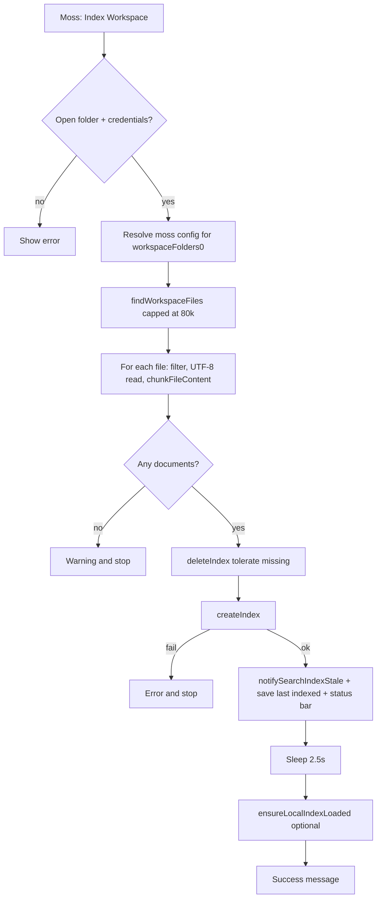

# Indexing flow in vscode-moss

This document describes **how workspace indexing works** inside the Moss VS Code extension: entry point, file discovery, chunking, upload, and what happens afterward. For a shorter checklist and code map, see [`WORKFLOW.md`](./WORKFLOW.md). For a Markdown-documentation–oriented pipeline (render → HTML → heading-aware chunks), see the repo’s [**moss-md-indexer** workflow](https://github.com/usemoss/moss/blob/main/packages/moss-md-indexer/INDEXER-WORKFLOW.md).

## Entry point

Indexing runs when the user triggers **`Moss: Index Workspace`** (command `moss.indexWorkspace`), including from the status bar item registered in `extension.ts`. The implementation lives in **`runIndexWorkspace`** in [`src/indexWorkspace.ts`](./src/indexWorkspace.ts).

 Preconditions:

- At least one **workspace folder** must be open; otherwise the command shows an error and returns.
- **Credentials** must resolve via `resolveCredentials` (settings, SecretStorage, or `MOSS_PROJECT_ID` / `MOSS_PROJECT_KEY`). If missing, the user sees an error and indexing does not start.

The work runs inside **`vscode.window.withProgress`** (notification area, **cancellable**).

## Configuration resolution

Before any I/O, the extension loads **`getMossConfig`** for the **first workspace folder** (`workspaceFolders[0]`). That yields:

- **`indexName`** — from `moss.indexName` or auto-generated from the workspace name when empty.
- **`includeGlobs` / `excludeGlobs`** — merged with extra safe excludes (`EXTRA_SAFE_EXCLUDES`, e.g. `**/.svn/**`) so dangerous paths are always filtered.
- **`respectGitignore`** — when true (default), apply each folder’s root `.gitignore` after the glob scan (see Step 1 below).
- **`maxFileSizeBytes`**, **`chunkMaxLines`**, **`chunkOverlapLines`**, **`modelId`**, etc.

Multi-root workspaces: **all roots are scanned**, but **settings** (globs, index name, chunk options) come from the **primary** folder only, consistent with the extension README.

## Step 1 — Discover files

**`findWorkspaceFiles`** uses `vscode.workspace.findFiles` with:

- **Includes** — from config (default effectively `**/*` if nothing is set).
- **Excludes** — brace-combined when possible, or multiple scans per include pattern.
- **Cap** — at most **`MAX_FILE_SCAN` (80,000)** URIs; if the scan hits the cap, indexing continues with a **warning** so users can narrow `moss.includeGlob` / `moss.excludeGlob`.

Files are **deduped** and **sorted** by `fsPath` for stable ordering.

When **`moss.respectGitignore`** is true (default), **`filterUrisByRootGitignore`** drops URIs that match each workspace folder’s **root** `.gitignore` (via the [`ignore`](https://www.npmjs.com/package/ignore) package, same semantics as Git for that file). **Nested** `.gitignore` files are not loaded. Set **`moss.respectGitignore`** to false to index ignored paths (for example build output).

## Step 2 — Read, filter, and chunk per file

For each URI (with cancellation checks between files):

1. **Workspace membership** — Skip if the file is not under any `WorkspaceFolder`.
2. **Binary extension** — Skip paths whose extension is in a fixed denylist (archives, images, binaries, fonts, etc.).
3. **Size** — Skip if `stat.size > maxFileSizeBytes`.
4. **Text** — Read bytes and decode as **UTF-8** with `fatal: true`; skip if decode fails or a `NUL` byte appears (treated as non-text).
5. **Relative path** — `asRelativePath` must be non-empty.
6. **Chunking** — **`chunkFileContent`** ([`chunking.ts`](./src/chunking.ts)) with:
   - `languageId` from the file extension where supported (Markdown, JS/TS, Python, Rust, Go, Java, Ruby, PHP, C/C++, C#, etc.).
   - **Structure-aware** chunks when the language is wired for Tree-sitter in [`structureChunking.ts`](./src/structureChunking.ts).
   - **Line-window fallback** in [`chunkCore.ts`](./src/chunkCore.ts) when structure-aware splitting is not used.

Each chunk becomes a Moss **`DocumentInfo`**: stable **`id`**, **`text`**, and string **`metadata`** (e.g. `path`, `startLine`, `endLine`; in multi-root, `workspaceFolderIndex` / `workspaceFolderName`).

**Chunk budget** — The in-memory list **`allDocs`** is capped at **`MAX_MOSS_DOCUMENTS` (60,000)**. When the limit is reached, remaining files are skipped and a **warning** is shown.

If no documents are produced (everything skipped or empty), indexing stops with a warning and **no** API upload.

## Step 3 — Upload to Moss

Progress shows **“Uploading index to Moss…”**.

1. Construct **`MossClient(projectId, projectKey)`**.
2. **`deleteIndex(indexName)`** — Wrapped in **`tolerateDeleteIndex`**: “not found” style errors are treated as OK; other failures are logged as warnings but do not necessarily abort (see implementation for exact behavior).
3. **`createIndex(indexName, allDocs, { modelId })`** — Full replace of the remote index content for that name.

On **success**:

- **`notifySearchIndexStale()`** — Tells sidebar search to **`resetSearchSession()`** so stale `loadIndex` / client state is cleared after a full reindex.
- **`workspaceState`** is updated under **`MOSS_LAST_INDEXED_KEY`** with index name, chunk count, file count, and timestamp (drives the status bar “indexed Xm ago” text).
- **`notifyMossIndexed()`** refreshes the status bar immediately.

On **`createIndex` failure**, the user sees an error message; workspace last-indexed state is **not** updated for this run.

## Step 4 — Local search cache warm-up (optional)

After upload, progress shows **“Preparing local search cache…”** and the code **`await sleep(POST_CREATE_SETTLE_MS)`** (**2.5s**) to let the service settle before downloading.

Then **`ensureLocalIndexLoaded(client, cfg.indexName, localState)`** runs on the **same** `MossClient` used for upload. The `localState` object is **fresh** for this call only (not shared with the sidebar session).

- If **`loadIndex`** succeeds, verbose logs note that the local query cache is warmed.
- If it **fails**, indexing still **succeeded**; search falls back to **cloud** `query` until a later successful `loadIndex` (for example from the sidebar). A non-cancellation cancel after upload may skip warm-up and show an informational message.

Finally, an information message summarizes files indexed and chunk count.

## Cancellation

The user can cancel from the progress notification. The implementation checks **`token.isCancellationRequested`** after the scan, during the per-file loop, before upload, before `createIndex`, and before / after the settle delay. Partial work is not uploaded unless `createIndex` already completed.

## Code reference summary

| Concern | Location |
|--------|-----------|
| Command registration | `src/extension.ts` |
| Orchestration, scan, upload, warm-up | `src/indexWorkspace.ts` (`runIndexWorkspace`, `findWorkspaceFiles`, `tolerateDeleteIndex`) |
| Credentials and `moss.*` resolution | `src/config.ts` |
| Chunking | `src/chunking.ts`, `src/chunkCore.ts`, `src/structureChunking.ts` |
| Last-indexed persistence (status bar) | `src/lastIndexed.ts`, `src/mossStatusBar.ts` |
| Invalidate sidebar search after reindex | `src/mossQueryState.ts` (`notifySearchIndexStale`) |
| Local index helper | `src/mossQueryState.ts` (`ensureLocalIndexLoaded`) |

## Diagram (high level)

